# Hi, I'm Afif 👋

I'm a Software Engineering student at Universiti Malaya building toward a career in cloud and ML engineering. I work mostly with **AWS serverless** architectures and **Python-based machine learning**, and I like shipping real, end-to-end projects — model, deployment, and infrastructure — rather than tutorial rebuilds. Outside of code I'm a golfer (founded my school's Golf Club) and a runner training for a half marathon.

## What I'm working on

- **[PGA Tour Scoring Predictor](https://github.com/mpip0505/golf-score-predictor)** — An end-to-end ML project predicting scoring averages, built with Python & scikit-learn, deployed as a static site and extended onto AWS (S3 + CloudFront).
- **[Serverless ML Inference API](https://github.com/mpip0505/ml-inference-api)** — A race-pace predictor served through AWS Lambda + API Gateway + S3, provisioned with Terraform.
- **Certifications & learning** — Working toward AWS Cloud Practitioner and AI Practitioner, plus NDG Linux Essentials, while setting up CI/CD automation with the AWS CLI.

## Tech stack

  
  
  
  
  
  
  
  

## GitHub stats

## Featured project

### ⛳ [PGA Tour Scoring Predictor](https://github.com/mpip0505/golf-score-predictor)

An end-to-end machine learning project that predicts PGA Tour scoring averages — from data pipeline and model training in Python & scikit-learn, through to deployment as a static site and an AWS build on S3 + CloudFront. Combines my two interests: golf and building things that actually ship.

  
  
  

### 🌏 MASA Hackathon 2026 — Climate Risk Actuarial Model

A team hackathon submission for Hannover Re: a climate-risk actuarial model for Southeast Asian disaster insurance, combining a time-aware ARIMAX forecasting model with a stochastic catastrophe engine. Worked through real modelling challenges including ARIMAX convergence, residual diagnostics, and synthetic-data design.

  
  
  

## Connect with me

  
  

